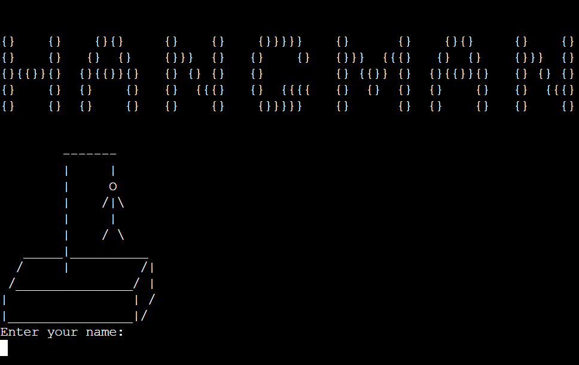
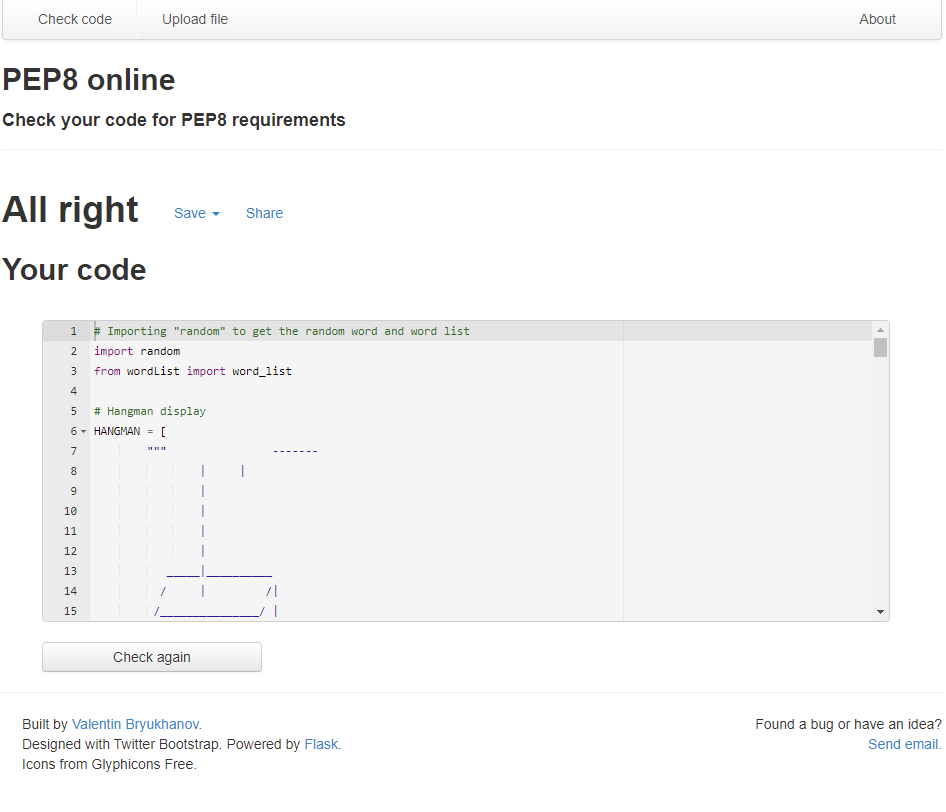

# Hangman

## Live Site

[Hangman](https://hangman-project-3.herokuapp.com/)

## Repository

https://github.com/gjularic/hangman-game

## Objective

Design an interactive Hangman game that can be constantly replayed. The Project runs in a terminal and is deployed via Heroku, using Python.

---
## Features

- The Game displays the hangman art depending on how many letters have been guessed wrong
- It will show how many chances are left until the game has been lost
- List of already used letters will be shown every turn
- Current state of the word is being displayed
- Finally, when the game is lost or won, user will get an option to play again

---

## Flowchart

## Technologies used

- Python
- [Lucidchart](https://lucid.co/) - for flowchart

## Testing

### Validator Testing

- [Python Validator](http://pep8online.com/)

    - `run.py` result

    

- tested if the HANGMAN variable is displaying hangman graphic correctly in the console
- tested random word generation
- tested user input guess
- used letters are being added to the list correctly
- status of the word is being updated correctly every turn
- tested while loops that are checking if user is typing numbers or multiple letters
- tested if play_again function works properly

## Bugs
- main while loop is stopping before user runs out of 7 tries - condition set up in the while loop needed to be changed
- it's possible to type in the same letter infinite number of times - added while loop to fix this
- user could type in the numbers - added while loop to fix, it will check if the user input is a number or letter
- user can type in multiple letters - added this into while loop so that only one letter can be typed in
- there's no way to play again when the game ends - put the code into separate functions as it has become more complex and to allow replayability

## Deployment

### Heroku
- Navigate to heroku dashboard
- Click "New" and select "Create new app"
- Input unique name for the app
- Select "Settings" from the tabs
- Click "Reveal Config Vars"
- Input PORT and 8000 and click add
- Click "Add buildpack"
- Add "nodejs" and "python" from the list, click save
- Select "Deploy" tab
- Select "GitHub - Connect to GitHub"
- Search for the GitHub repository by name
- Click Enable Automatic Deploys for automatic deploys or Deploy Branch to deploy manually

## Credits

- [W3schools](https://www.w3schools.com/)
- [Hangman ASCII art](https://github.com/gieseanw/Hangman/blob/master/HangmanLogo2.txt) - made and adjusted the states from it
- [StackOverflow](https://stackoverflow.com/)