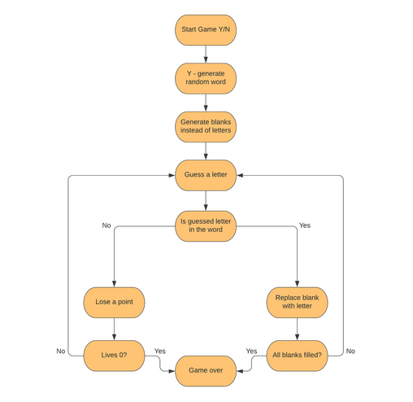

## Flowchart

## Technologies used

- Python
- [Lucidchart](https://lucid.co/) - for flowchart

## Testing

- tested if the HANGMAN variable is displaying hangman graphic correctly in the console
- tested random word generation
- tested user input guess
- used letters are being added to the list correctly
- status of the word is being updated correctly every turn
- tested while loops that are checking if user is typing numbers or multiple letters

## Credits

- [W3schools](https://www.w3schools.com/)
- [Hangman ASCII art](https://github.com/gieseanw/Hangman/blob/master/HangmanLogo2.txt) - made and adjusted the states from it
- [StackOwerflow](https://stackoverflow.com/)

## Bugs
- main while loop is stopping before user runs out of 7 tries - condition set up in the while loop needed to be changed
- it's possible to type in the same letter infinite number of times - added while loop to fix this
- user could type in the numbers - added while loop to fix, it will check if the user input is a number or letter
- user can type in multiple letters - added this into while statement so that only one letter can be typed in